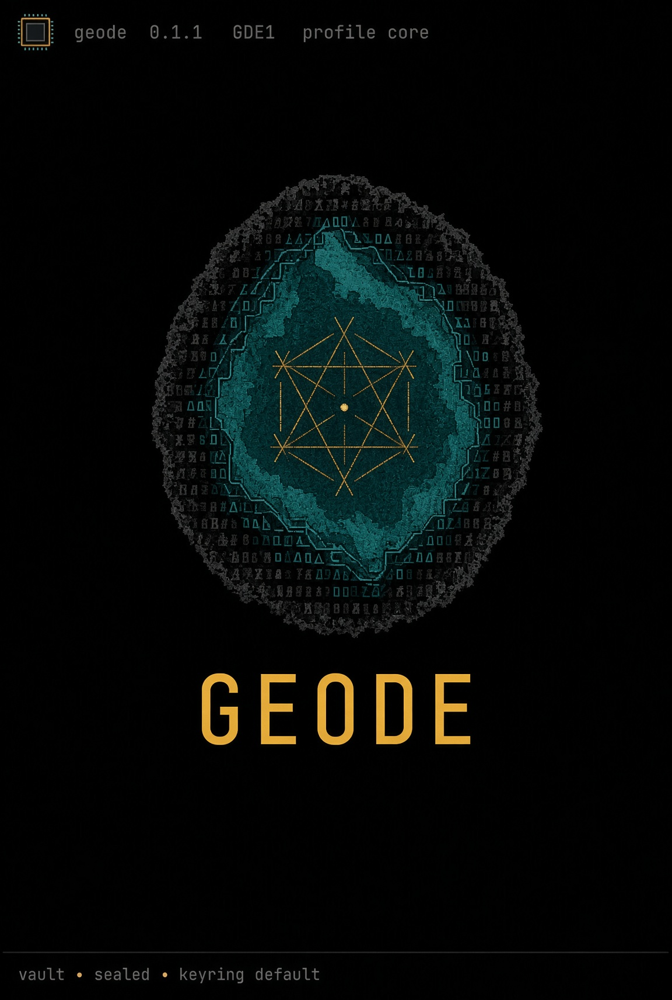

<p align="center">
  <a href="https://github.com/VirtualMachinist/geode">
    
  </a>
</p>

<h1 align="center">Geode</h1>

<p align="center">
  <strong>Stone outside. Structure inside.</strong><br>
  File and directory custody for a shared disk — humans and agents.
</p>

<p align="center">
  <a href="https://github.com/VirtualMachinist/geode/actions/workflows/ci.yml"></a>
  <a href="https://github.com/VirtualMachinist/geode/releases/tag/v0.2.1"></a>
  <a href="https://crates.io/crates/geode-grotto"></a>
  <a href="https://crates.io/crates/geode-cli"></a>
  <a href="https://rustup.rs"></a>
  <a href="LICENSE"></a>
</p>

<p align="center">
  <a href="#quick-start">Quick start</a> ·
  <a href="#what-you-get">What you get</a> ·
  <a href="#how-it-works">How it works</a> ·
  <a href="#status">Status</a> ·
  <a href="CHANGELOG.md">Changelog</a> ·
  <a href="crates/geode-core">Library</a> ·
  <a href="vectors/v1">Vectors</a> ·
  <a href="#contributing">Contributing</a>
</p>

<p align="center">
  Built by <a href="https://hedronite.com">Hedronite</a>'s <a href="https://github.com/VirtualMachinist">VirtualMachinist</a>.
</p>

---

Geode seals files and directory trees so people and agents can share a disk without sharing plaintext. Ciphertext lives on the disk. Keys stay with the operator. Agents get scoped tokens, not the identity key.

The on-disk format is **GDE1**, cipher suite **`0x01`**: AEGIS-256-X2, BLAKE3, Argon2id, and HCTR2-256. The binary is `geode`. The library crate is [`geode-grotto`](https://crates.io/crates/geode-grotto) (directory [`crates/geode-core`](crates/geode-core)).

It is not a FUSE mount, not a post-quantum suite, and not an interop layer for other custody formats.

| | Pin |
|---|---|
| Format | GDE1, suite `0x01` |
| Binary | `geode` ([`geode-cli`](crates/geode-cli)) |
| Library | [`geode-grotto`](crates/geode-core) (Rust import `geode_grotto`) |
| TUI | [`geode-tui`](crates/geode-tui), default feature `tui` |
| Version | **0.2.1** · [v0.2.1](https://github.com/VirtualMachinist/geode/releases/tag/v0.2.1) · [CHANGELOG](CHANGELOG.md) |
| Rust | 1.85 |
| License | [Apache-2.0](LICENSE) |

## Quick start

Rust **1.85+**. Install the CLI from crates.io, or run it from this repo.

```sh
cargo install geode-cli
# from a clone: cargo run -p geode-cli --
```

Then generate a key, init a vault, seal one file, and read it back:

```sh
mkdir /tmp/geode-demo && cd /tmp/geode-demo

geode keygen ./demo.gkey
geode --key ./demo.gkey vault init ./vault.geode
printf 'stone outside\n' > note.txt
geode --key ./demo.gkey seal note.txt ./vault.geode
geode --key ./demo.gkey list ./vault.geode
geode --key ./demo.gkey cat ./vault.geode note.txt
```

`--key` is required unless a keyring default or `~/.config/hedronite/geode/default.gkey` exists (`$XDG_CONFIG_HOME` honored). `geode keygen` with no path writes `./secret.gkey` and warns. Key files are mode `0600` and gitignored (`*.gkey`); never commit one.

A `--no-default-features` build has no TUI: `geode tui` then exits 1.

## What you get

| | Shared disk | Geode |
|---|---|---|
| Bytes on disk | Plaintext files | GDE1 objects (chunked AEAD, merklized content root) |
| Filenames | Visible | Plaintext by default; `--seal-names` stores HCTR2-256 ciphertext names |
| Humans | Any editor | `geode` CLI and the operator TUI (`geode tui`) |
| Agents | The same key, or raw files | Scoped `GTOK` tokens; `geode agent list` / `read` / `write`; `geode agent serve --stdio` MCP tools `geode_list`, `geode_read`, `geode_write` |
| Integrity | Hope | `geode verify` (full / `--cheap` / `--sample P`); exit **2** is auth/integrity |
| History | Copies | Named snapshots and `gc` (TUI previews `gc` before confirm) |
| Identity | Ad hoc | `geode keygen` / `geode keyring`; OS keyring with a `0600` file fallback |

### What you do not get

| Claim | Reality |
|---|---|
| FUSE mount | Not shipped. `geode open VAULT DST` extracts plaintext to a directory. |
| Post-quantum | Suite `0x01` only. No `pq` feature. |
| Unix-socket MCP | `geode agent serve --stdio` ships. Socket transport exits 1. |
| TUI unlock via token | The TUI is a human surface. `--token` / `GEODE_TOKEN` exist on agent verbs only. |

## How it works

One rule: **ciphertext on the shared disk; the identity key stays with the operator; agents carry a scoped token.**

- A vault is a directory with a `GEODE` sentinel, MAC'd `header.json` / `manifest.json`, and object files under `epochs/`.
- Objects are sealed under an epoch key: AEGIS-256-X2 chunks, BLAKE3 content root, JCS-canonical manifest MAC, symmetric recipient wrap, optional path-bind.
- `--seal-names` stores ciphertext filenames (HCTR2-256, length-preserving). Golden vector: [`vectors/v1/name.json`](vectors/v1/name.json).
- `geode agent token issue` mints a `GTOK` (TTL, ops, `--allow-prefix`, `max_bytes`). Tokens are not the identity key and never carry key material.
- Scripts must treat exit **2** as authentication/integrity failure. Usage and I/O are exit **1**. Clap parse errors are forced to 1 so 2 stays unambiguous.
- `unsafe_code` is forbidden in the workspace.

<details>
<summary>Repository map</summary>

```
crates/geode-core/    # geode-grotto — format, crypto, vault, policy, keyring, agent ops
crates/geode-cli/     # geode binary (clap adapter)
crates/geode-tui/     # Ratatui operator surface (default feature tui)
vectors/v1/           # golden vectors: kdf, chunk, wrap, name
```

</details>

## Status

Workspace **0.2.1** matches git tag [`v0.2.1`](https://github.com/VirtualMachinist/geode/releases/tag/v0.2.1) and the crates.io versions of `geode-grotto` / `geode-cli`. GDE1 objects from 0.2.0 remain readable; the format is frozen at suite `0x01`.

Shipped on this tag:

- Keygen (raw or `--password` wrap) and keyring (`list` / `add`)
- `vault init`, `seal`, `open`, `verify`, `list`, `cat` (`--max-bytes`)
- `--seal-names`, `snapshot create|ls`, `gc`
- Operator TUI (`geode tui [VAULT]`, default feature `tui`)
- Agent plane: `token issue|inspect`, `agent list|read|write`, `agent serve --stdio`

CI ([`.github/workflows/ci.yml`](.github/workflows/ci.yml)): `cargo test --workspace --locked` and `clippy -D warnings` on `ubuntu-latest`.

Known gaps are the rows in [What you do not get](#what-you-do-not-get). Do not claim a mount, a PQ suite, or TurboCrypt decryption from this repo.

## Contributing

Issues and pull requests are welcome. There is no separate `CONTRIBUTING.md` yet; match CI:

```sh
cargo test --workspace --locked
cargo clippy --workspace --all-targets -- -D warnings
```

Rust **1.85**. Release notes live in [CHANGELOG.md](CHANGELOG.md). Conformance vectors live in [`vectors/v1/`](vectors/v1).

## Credits and license

Geode is built and maintained by [Hedronite](https://hedronite.com). Apache-2.0 — see [LICENSE](LICENSE). The Geode name is Hedronite's.
